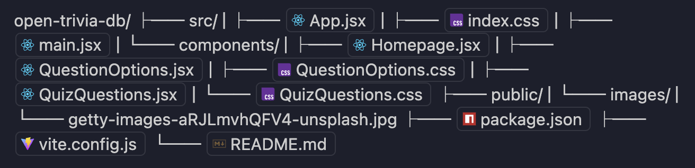
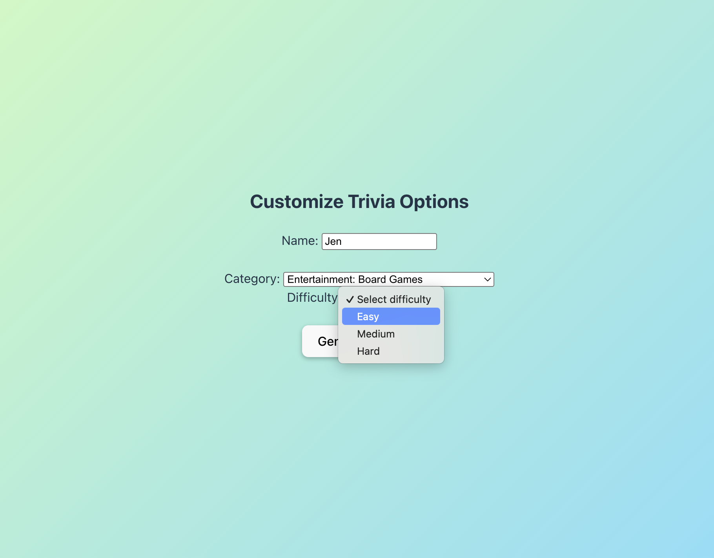
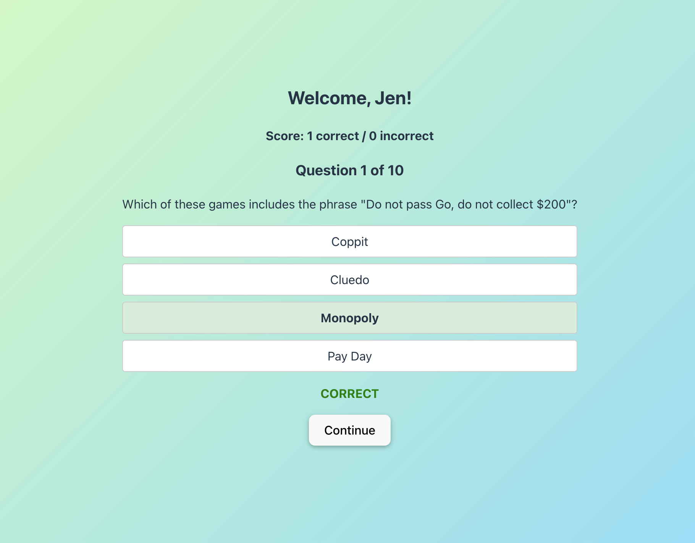
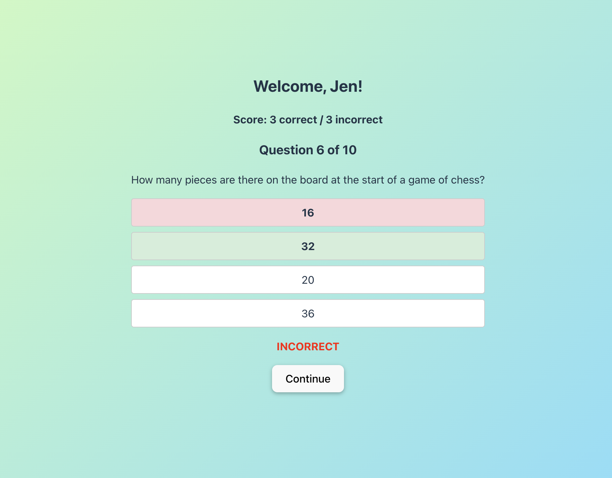
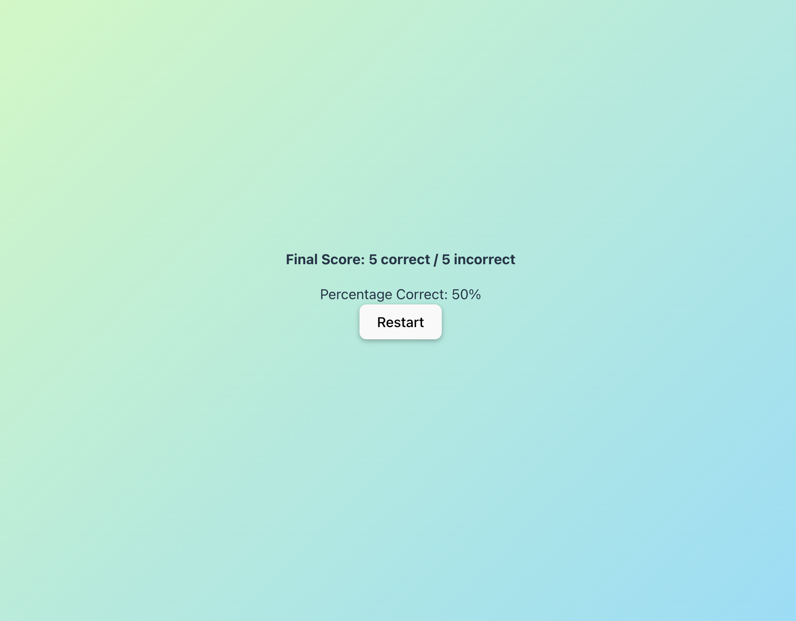

# Custom Trivia Quiz App

## Author

[Jen Planque](https://github.com/jenplanque)

---

## Table of Contents

- [Custom Trivia Quiz App](#custom-trivia-quiz-app)
  - [Author](#author)
  - [Table of Contents](#table-of-contents)
  - [Introduction](#introduction)
  - [Technologies Used](#technologies-used)
  - [Project Structure](#project-structure)
  - [Features](#features)
  - [Prerequisites](#prerequisites)
  - [Installation](#installation)
  - [Usage](#usage)
  - [Collaborators](#collaborators)
  - [Screenshots](#screenshots)
  - [Acknowledgements](#acknowledgements)

---

## Introduction

This project is a mini quiz application built with React and Vite. It uses the [Open Trivia Database API](https://opentdb.com/) to fetch multiple-choice trivia questions. The app guides users through a simple flow: entering their name, selecting a category and difficulty level, to answer ten (10) randomly-generated trivia questions. The UI is interactive and responsive, providing immediate feedback and allowing users to retake the same quiz or generate a new one at the end.

---

## Technologies Used

- [React 19](https://react.dev/)
- [Vite](https://vitejs.dev/)
- [Open Trivia Database API](https://opentdb.com/)
- JavaScript (ES2020+)
- CSS

---

## Project Structure



---

## Features

- **Home Page Form**
  - Welcome message, instructions, and input for user's first name
  - Dropdowns for selecting question category and difficulty (easy, medium, hard)
  - All fields are required; error messages are shown if any are missing
- **Quiz Section**
  - Fetches 10 multiple-choice questions from the Open Trivia Database API based on user selections
  - Displays one question at a time with shuffled answer options as clickable choices
  - Immediate feedback after each answer: correct/incorrect, and the correct answer if wrong
  - Score tracking and progress display
- **Results Section**
  - Personalized message with user's name and final score
  - Option to restart the quiz and try again
- **Error Handling**
  - Handles API errors and user input errors gracefully
- **Responsive UI**
  - Clean, modern styling with CSS

---

## Prerequisites

- Node.js (v18 or higher recommended)
- npm (v9 or higher recommended)

---

## Installation

1. **Clone the repository:**

   ```sh
   git clone https://github.com/jenplanque/open-trivia-db.git
   cd open-trivia-db

   ```

2. **Install dependencies:**

   ```sh
   npm install
   ```

3. **Start the development server:**

   ```sh
   npm run dev
   ```

4. **Open your browser and navigate to:**
   ```sh
   http://localhost:5173/
   ```

---

## Usage

1. On the home page, enter your name, select a trivia category and difficulty level, then click "Generate Quiz"
2. Answer each multiple-choice question to receive instant feedback after each answer
3. At the end, view your results and percentage guessed correctly
4. Click "Restart" to play the same quiz again with different questions, or hit your browser's refresh button to pick an entirely new setup.

---

## Collaborators

- Big shout out to [Katelyn Mehner](https://github.com/kmehner) for always helping me keep my code clean and organized

---

## Screenshots

- **Home Page - Trivia Options Form:**  
  

- **Quiz in Progress:**  
  Correct Answer:
  
  Incorrect Answer:
  

- **Results Section:**  
  

---

## Acknowledgements

- [Open Trivia Database](https://opentdb.com/) for providing the trivia questions API
